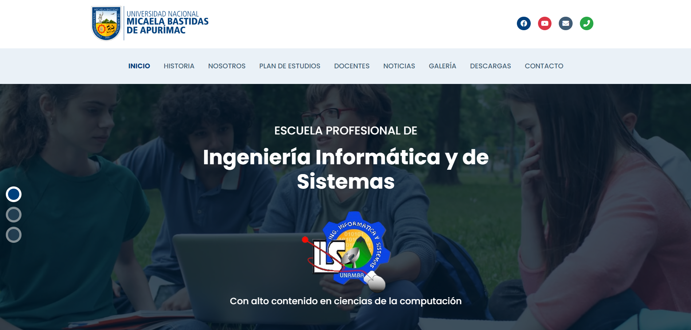

    
    <h1>JhairDev - Unamba </h1>
    

        Full Stack Developer Jhair
    

# Página Web

Bienvenido a la web de **Ingeniería Informática y Sistemas - UNAMBA**
Accede a toda la información relacionada con la carrera de Ingeniería Informática y Sistemas en el Vabellón de la Universidad Nacional Micaela Bastidas de Apurímac.
## Tecnologías Utilizadas

- **HTML**: Lenguaje utilizado para estructurar la interfaz de usuario.
- **CSS**: Lenguaje utilizado para estilizar y diseñar la apariencia de la aplicación.
- **JavaScript**: Lenguaje utilizado para la lógica y funcionalidad de la aplicación.
- **SASS**: Preprocesador de CSS utilizado para mejorar la organización y el mantenimiento del código de estilo.
- **Bootstrap**: Framework utilizado para el diseño y estilización de la interfaz de usuario, proporcionando componentes predefinidos.

---

## Ejecución

1. **Click ala pagina index.**
    
2. **Abre tu navegador y visita `http://127.0.0.1:5500/index.html`.**

¡Listo! Ahora puedes comenzar a trabajar en la web sin problemas.

